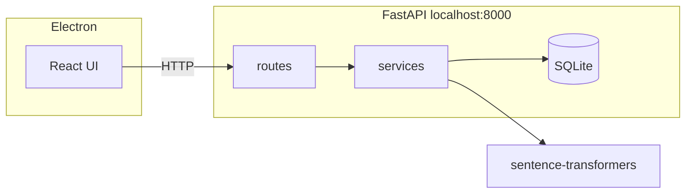

# DodocLens

**DodocLens** is a local-first desktop MVP for **document intelligence**: upload PDFs and images, extract text (including OCR when needed), split content into chunks, compute **semantic embeddings** entirely on-device, and search by **meaning** — not just keywords. No OpenAI, no paid cloud APIs; suitable for sensitive professions.

**Target users:** legal teams, clinicians, researchers, and anyone who needs **privacy-preserving** search over their own files.

---

## Table of contents

1. [Project overview](#project-overview)
2. [Architecture](#architecture)
3. [AI & retrieval (how it works)](#ai--retrieval-how-it-works)
4. [Processing pipeline](#processing-pipeline)
5. [Technical decisions](#technical-decisions)
6. [How to run](#how-to-run)
7. [Packaging & installers](#packaging--installers)
8. [API reference](#api-reference)

---

## Project overview

- **Upload** PDF, PNG, or JPG files; they are stored under `backend/data/uploads/`.
- **Extract** text: native PDF text when available; otherwise **Tesseract OCR** (images and “scanned” PDFs).
- **Chunk** normalized text into overlapping segments (~400 words) for manageable embedding size and better recall.
- **Embed** each chunk with **sentence-transformers** (`all-MiniLM-L6-v2`) and persist vectors (as JSON) in **SQLite**.
- **Search** with a natural-language query: the query is embedded the same way, and the app ranks chunks by **cosine similarity**, returning the **top 5** hits.

The **Electron** shell starts (or attaches to) the **FastAPI** backend and serves the **React** UI (Vite in development, static `dist` in production).

---

## Architecture

| Layer | Role |
|--------|------|
| **Electron** (`electron/main.cjs`) | Opens the window, optionally spawns `backend/main.py`, waits for `GET /health`, loads the UI (dev server or `frontend/dist`). |
| **React + Vite** (`frontend/`) | SPA: upload, document list, semantic search, theme toggle; talks to the API over HTTP (Axios). |
| **FastAPI** (`backend/`) | REST API, background processing, SQLite access, embedding + search orchestration. |
| **SQLite** | `documents` and `chunks` tables; file metadata, chunk text, and serialized embedding vectors. |
| **Local AI** | **sentence-transformers** + **PyTorch** for embeddings; **scikit-learn** for cosine similarity. |
| **OCR / PDF** | **PyMuPDF** for PDFs; **pytesseract** for OCR when text density is low or input is an image. |

High-level flow:



---

## AI & retrieval (how it works)

### What are embeddings?

An **embedding** is a fixed-length vector of numbers that represents the **semantic content** of a piece of text. Similar ideas (even with different wording) tend to land **close together** in this vector space. We use a **sentence-level** model (`all-MiniLM-L6-v2`) so each **chunk** of your document becomes one vector (~384 dimensions).

### How semantic search works

1. At **index time**, every chunk gets an embedding and is stored in the database.
2. At **query time**, your question is embedded with the **same model**.
3. The system compares the query vector to every chunk vector and sorts by similarity.

### Why cosine similarity?

**Cosine similarity** measures the angle between two vectors (ignoring magnitude to a large extent). For normalized embedding vectors it behaves like a **semantic match score** in roughly **[0, 1]**: higher means “closer in meaning.” It is standard for text embeddings, simple to implement, and fast enough for MVP-scale local indexes.

### Why local models?

- **Privacy:** text never leaves the machine.
- **Cost:** no per-token API fees.
- **Offline:** after the model is cached, operation does not require the internet.

Trade-off: you maintain **PyTorch** + model weights locally and accept **CPU/GPU** resource use on first indexing and search.

---

## Processing pipeline

1. **Upload** — `POST /upload` saves the file, inserts a `documents` row (`pending`), and schedules a **FastAPI `BackgroundTasks`** job.
2. **OCR / text extraction** — PDFs with sufficient selectable text use PyMuPDF; sparse text triggers per-page rendering + Tesseract. Images always use OCR.
3. **Normalization** — Unicode cleanup and whitespace normalization (`utils/text.py`).
4. **Chunking** — Overlapping word windows (~400 words) to preserve context across boundaries (`services/chunking.py`).
5. **Embedding generation** — The model encodes each chunk; vectors are serialized to JSON and stored per row in `chunks.embedding_json`.
6. **Storage** — SQLite holds document metadata, chunk text, and embeddings.
7. **Semantic search** — `POST /search` embeds the query, loads chunk vectors, computes cosine similarity, returns **top 5** with scores and text (including **full chunk** text for the UI modal).

---

## Technical decisions

| Decision | Rationale |
|-----------|-----------|
| **SQLite** | Zero server setup, single-file DB, ideal for a **desktop MVP** and offline use. PostgreSQL would add deployment and ops overhead without MVP benefit. |
| **No external AI APIs** | Aligns with **privacy**, **offline**, and **zero recurring cost** goals; mandatory for many legal/medical scenarios. |
| **Embeddings in SQLite as JSON** | Keeps the stack simple; acceptable for thousands of chunks. At larger scale, consider a vector DB or binary storage. |
| **Electron + spawned Python** | Reuses a mature web UI while keeping ML in Python. Packaged installers still need a clear story for **bundled or system Python** (see packaging). |

**Trade-offs:** very large libraries will be slower to index on CPU; global search loads all chunk vectors into memory for similarity — fine for MVP, revisit for scale.

---

## How to run

### Prerequisites

- **Python 3.10+**, **Node.js 18+**
- **Tesseract** installed and on `PATH` (required for OCR paths)

#### Tesseract on Windows

1. Download an installer from the [UB Mannheim builds](https://github.com/UB-Mannheim/tesseract/wiki) or [Tesseract releases](https://github.com/tesseract-ocr/tesseract).
2. Install and add the folder (e.g. `C:\Program Files\Tesseract-OCR`) to **PATH**.
3. If Python still cannot find it, set `pytesseract.pytesseract.tesseract_cmd` (see comments in `backend/services/text_extraction.py`).

**macOS:** `brew install tesseract`  
**Arch Linux:** `sudo pacman -S tesseract tesseract-data-eng`  
**Debian/Ubuntu:** `sudo apt install tesseract-ocr`

### Backend (Python)

```bash
cd backend
python3 -m venv .venv
source .venv/bin/activate          # Windows: .venv\Scripts\activate
pip install -r requirements.txt
python3 main.py                    # http://127.0.0.1:8000
```

The first run may download the embedding model into the Hugging Face cache (~90MB).

### Frontend (web UI only)

With the API already running:

```bash
cd frontend
npm install
npm run dev
```

Optional: `VITE_API_URL` if the API is not at `http://127.0.0.1:8000`.

### Full desktop (Electron + Vite)

From the **repository root**:

```bash
cd backend && python3 -m venv .venv && source .venv/bin/activate && pip install -r requirements.txt && cd ..
npm install && cd frontend && npm install && cd ..
npm run dev
```

Electron probes `http://127.0.0.1:8000/health`; if nothing responds quickly, it spawns `python3 backend/main.py` (or `python` on Windows).

**Use the venv interpreter from Electron:**

```bash
export DODOC_PYTHON="$(pwd)/backend/.venv/bin/python"
npm run dev
```

Windows PowerShell:  
`$env:DODOC_PYTHON = "...\backend\.venv\Scripts\python.exe"`

### Production-style run (no Vite dev server)

```bash
npm install
cd frontend && npm install && npm run build && cd ..
npm run electron:prod
```

---

## Packaging & installers

`electron-builder` is configured in the root `package.json` (`build` field): **asar** with **`backend/**` unpacked** so Python can read source files from disk when packaged.

| Script | Purpose |
|--------|---------|
| `npm run build:fe` | Production build of the React app → `frontend/dist`. |
| `npm run pack` | Build frontend + unpackaged app dir (quick test). |
| `npm run dist` / `npm run build:installer` | Build installer artifacts under `release/` (e.g. AppImage/deb, NSIS, DMG). |
| `npm run build:desktop` | Same as full builder with `--publish never`. |

**Before shipping:** plan for **Python runtime** (system install vs embedded), **Tesseract** distribution, and **offline model cache**. The current setup is **structure-ready**, not a turnkey binary distribution.

---

## API reference

| Method | Path | Description |
|--------|------|-------------|
| GET | `/health` | Liveness; used by Electron startup. |
| POST | `/upload` | Multipart file upload. |
| GET | `/documents` | List documents. |
| GET | `/documents/{id}` | Document detail + text preview. |
| POST | `/search` | Body: `{ "query": "..." }` — semantic search (top 5, includes `full_text` per hit). |

---

## License

See the `LICENSE` file in this repository.
