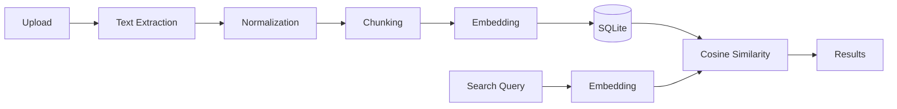

# DodocLens

[](./README.pt-BR.md)

Local-first document intelligence. Semantic search over your files — fully offline, fully private.

   

## Overview

DodocLens is a desktop-friendly document assistant that runs entirely on your machine. You upload PDFs, images (PNG/JPG), and plain text files (`.txt`); the app extracts readable text (including OCR when needed), splits content into chunks, and builds semantic embeddings so you can search by **meaning**, not just exact keywords.

Text extraction uses **PyMuPDF** for PDFs with a text layer and **Tesseract** (via **pytesseract** and **Pillow**) when pages are effectively scanned or when the input is an image. Chunk embeddings use **sentence-transformers** with **`paraphrase-multilingual-MiniLM-L12-v2`** — a compact multilingual model suited for Portuguese and English clinical or legal prose. Search ranks chunks with **cosine similarity** (**scikit-learn** `cosine_similarity` plus **NumPy** arrays in the MVP pipeline). No cloud inference APIs are required: after a one-time model download, your documents and queries stay on your device.

The stack targets **legal professionals**, **clinicians**, and **researchers** who need confidential search over their own libraries without sending data to third parties.

## Architecture overview

| Layer | Technology | Role |
|-------|-------------|------|
| Desktop shell | Electron | Hosts the UI, optional backend spawn, file-system access (e.g. folder picker). |
| UI | React + Vite + TypeScript + Tailwind | SPA: upload, document library, semantic search; HTTP client to the local API. |
| API | FastAPI + Uvicorn | REST endpoints, background processing hooks, CORS for local dev. |
| Persistence | SQLite + SQLAlchemy | Stores documents, chunk text, and serialized embedding vectors. |
| Embeddings | sentence-transformers + PyTorch | Loads the multilingual MiniLM model; encodes chunks and queries. |
| Retrieval | scikit-learn (`cosine_similarity`) + NumPy | Compares query vector to stored chunk vectors for top results. |
| PDF / images | PyMuPDF, pytesseract + Pillow | PDF text layer vs. rasterized OCR paths; image OCR. |


```mermaid
flowchart LR
  U[Upload] --> E[Text Extraction]
  E --> N[Normalization]
  N --> C[Chunking]
  C --> M[Embedding]
  M --> DB[(SQLite)]
  Q[Search Query] --> MQ[Embedding]
  DB --> CS[Cosine Similarity]
  MQ --> CS
  CS --> R[Results]
```

## Prerequisites

Install these **before** running the app. **Python itself** should be managed with **uv** (do not rely on a manually curated global Python for this project).

### Python 3.10–3.13 (via uv)

**Do not install CPython manually** from your OS package manager for this workflow. After **uv** is installed (next subsection), **`uv sync`** and **`uv python pin 3.13`** (see [Installation](#installation)) download and pin a supported **3.10–3.13** interpreter that matches `backend/pyproject.toml` and **`uv.lock`**.

### Node.js 18+

- **Linux (Arch / CachyOS)**

  ```bash
  sudo pacman -S nodejs npm
  ```

- **macOS**

  ```bash
  brew install node
  ```

- **Windows**

  Install the LTS build from [nodejs.org](https://nodejs.org/).

### uv (Python package manager)

- **Linux / macOS**

  ```bash
  curl -LsSf https://astral.sh/uv/install.sh | sh
  ```

- **Windows (PowerShell)**

  ```powershell
  powershell -ExecutionPolicy ByPass -c "irm https://astral.sh/uv/install.ps1 | iex"
  ```

### Tesseract OCR

Required for image OCR and for PDFs that need raster OCR. Install **English** and **Portuguese** language packs where available.

- **Linux (Arch / CachyOS)**

  ```bash
  sudo pacman -S tesseract tesseract-data-eng tesseract-data-por
  ```

- **macOS**

  ```bash
  brew install tesseract tesseract-lang
  ```

- **Windows**

  Install from [UB Mannheim builds](https://github.com/UB-Mannheim/tesseract/wiki) and add `tesseract.exe` to **PATH** (see also comments in `backend/services/text_extraction.py`).

**Note:** After `uv sync`, run **`uv python pin 3.13`** (or another supported 3.10–3.13 version) inside `backend/` so the project uses a consistent interpreter.

## Installation

1. **Clone the repository**

   ```bash
   git clone https://github.com/moonlitrevery/DodocLens.git
   cd DodocLens
   ```

2. **Install uv** (if it is not already installed)

   ```bash
   curl -LsSf https://astral.sh/uv/install.sh | sh
   ```

   On Windows, use the PowerShell one-liner from the prerequisites table.

3. **Install Python dependencies** (creates `backend/.venv` and installs from the lockfile)

   ```bash
   cd backend
   uv sync
   ```

   This reads `pyproject.toml` and `uv.lock`, resolves dependencies, and installs them into an isolated virtual environment.

4. **Pin the Python version** for the backend workspace

   ```bash
   cd backend
   uv python pin 3.13
   ```

5. **Install root npm dependencies** (Electron tooling, `concurrently`, etc.)

   ```bash
   cd ..   # repository root
   npm install
   ```

6. **Install frontend dependencies**

   ```bash
   npm install --prefix frontend
   ```

**First model download:** On the first embedding run, **sentence-transformers** downloads **`paraphrase-multilingual-MiniLM-L12-v2`** (~**120 MB**). You need internet **once**; afterwards the model stays in the Hugging Face cache (see `HF_HOME` if you want a custom location).

## Running the application

### Backend only

```bash
cd backend
uv run python main.py
```

The API listens at **http://127.0.0.1:8000**.

### Frontend only (browser; backend must be running)

```bash
cd frontend
npm run dev
```

The UI is served at **http://127.0.0.1:5173** (default Vite port).

### Full desktop app (Electron)

**Terminal 1 — backend**

```bash
cd backend
uv run python main.py
```

**Terminal 2 — Electron** (from the **repository root**)

```bash
export DODOC_PYTHON="$(pwd)/backend/.venv/bin/python"
npm run dev
```

On **Windows (PowerShell)**, from the repo root:

```powershell
$env:DODOC_PYTHON = "$PWD\backend\.venv\Scripts\python.exe"
npm run dev
```

**Why `DODOC_PYTHON`:** Electron can spawn the FastAPI process using a system `python3` that does **not** have your project dependencies. Setting `DODOC_PYTHON` to the **`uv`-managed interpreter** inside `backend/.venv` ensures the backend starts with the correct packages (FastAPI, sentence-transformers, etc.).

### Production build

```bash
npm run electron:prod
```

This runs **`npm run build --prefix frontend`** (producing `frontend/dist/`) and then starts Electron, which loads the built SPA instead of the Vite dev server.

## Testing each module

#### 7.1 Backend API (FastAPI health check)

```bash
curl http://127.0.0.1:8000/health
```

**Expected output:**

```json
{"status":"ok"}
```

#### 7.2 Text extraction

From the **`backend/`** directory, with a real file path:

```bash
cd backend
uv run python -c "
from pathlib import Path
from services.text_extraction import extract_text
text = extract_text(Path('path/to/your.pdf'), 'application/pdf')
print(text[:500])
"
```

**Expected:** Up to 500 characters of extracted text printed to stdout (may be empty for blank PDFs).

#### 7.3 Embedding model

```bash
cd backend
uv run python -c "
from services.embeddings import embed_texts
vecs = embed_texts(['embedding test'])
print(vecs.shape)
"
```

**Expected:** `(1, 384)` — one row, 384-dimensional vector for this model configuration.

#### 7.4 Semantic search (via API)

```bash
curl -X POST http://127.0.0.1:8000/search \
  -H "Content-Type: application/json" \
  -d '{"query": "your question here"}'
```

**Expected:** JSON with a `results` array (possibly empty until documents are indexed and `ready`).

#### 7.5 Batch folder import (Electron)

Folder import uses native directory selection and (in Electron) can batch paths to **`POST /upload/batch`**. Run the **full Electron app** (`npm run dev` with backend running), open the **Upload** page, and click **Importar pasta**. After choosing a folder, supported files are queued for processing.

**Expected:** Toasts per imported file and a summary; new rows appear under **Documents** as processing completes.

#### 7.6 OCR test (image)

From **`backend/`**, pointing at a PNG on disk:

```bash
cd backend
uv run python -c "
from pathlib import Path
from services.text_extraction import extract_text
text = extract_text(Path('path/to/your.png'), 'image/png')
print(text[:500])
"
```

**Expected:** OCR text (quality depends on image resolution and Tesseract language data).

## Environment variables

| Variable | Default | Description |
|----------|---------|-------------|
| `DODOC_PYTHON` | Auto-detected (`backend/.venv` when present) | Absolute path to the Python executable Electron uses to spawn `backend/main.py`. |
| `VITE_API_URL` | `http://127.0.0.1:8000` | Base URL for the frontend Axios client (set before `npm run dev` in `frontend/`). |
| `DODOC_LOAD_DIST` | unset | If set to `1`, Electron prefers loading **`frontend/dist`** instead of the Vite dev server (useful with `npm run electron:prod` patterns). |
| `HF_HOME` | platform default | Optional override for Hugging Face / sentence-transformers model cache location. |

## Project structure

```text
DodocLens/
├── LICENSE                         # GPL-3.0 license text
├── README.md                       # This file (English)
├── README.pt-BR.md                 # Brazilian Portuguese README
├── package.json                    # Root scripts: Electron, dev, production
├── electron/
│   ├── main.cjs                    # Electron main: window, backend spawn, IPC
│   └── preload.cjs                 # contextBridge: platform, folder picker API
├── backend/
│   ├── pyproject.toml              # Python dependencies (uv)
│   ├── uv.lock                     # Locked dependency versions
│   ├── main.py                     # FastAPI app entry + lifespan / CORS
│   ├── database/
│   │   ├── __init__.py
│   │   └── connection.py           # SQLAlchemy engine + session helpers
│   ├── models/
│   │   ├── __init__.py
│   │   ├── orm.py                  # Document / Chunk ORM models
│   │   └── schemas.py              # Pydantic request/response models
│   ├── routes/
│   │   ├── __init__.py
│   │   ├── upload.py               # POST /upload
│   │   ├── batch.py                # POST /upload/batch (local paths)
│   │   ├── documents.py            # GET /documents, GET /documents/{id}
│   │   └── search.py               # POST /search
│   ├── services/
│   │   ├── __init__.py
│   │   ├── text_extraction.py      # PyMuPDF + Tesseract OCR paths
│   │   ├── file_storage.py         # Saves uploads under backend/data/uploads
│   │   ├── processing.py           # Background pipeline: extract → embed → SQLite
│   │   ├── chunking.py             # Word-window chunking
│   │   ├── embeddings.py           # sentence-transformers singleton
│   │   └── search_service.py       # Semantic search over stored vectors
│   └── utils/
│       ├── __init__.py
│       └── text.py                 # Text normalization helpers
└── frontend/
    ├── index.html                  # Vite HTML shell
    ├── package.json                # React, Vite, Tailwind deps
    ├── vite.config.ts              # Vite configuration
    ├── tsconfig.json
    ├── tailwind.config.js
    ├── postcss.config.js
    └── src/
        ├── main.tsx                # React root
        ├── App.tsx                 # Router + layout
        ├── global.d.ts             # Window typings (e.g. electronAPI)
        ├── vite-env.d.ts
        ├── index.css               # Global styles / Tailwind layers
        ├── types.ts                # Shared TS interfaces
        ├── api/
        │   └── client.ts           # Axios instance + base URL
        ├── context/                # Toast, theme providers
        ├── components/             # Layout, sidebar, modals, UI widgets
        ├── pages/                  # Upload, Documents, Search
        └── utils/                  # Highlighting, date formatting, etc.
```

Runtime directories such as **`backend/data/`** (SQLite DB, uploads) are created when you run the app; they may be absent in a fresh clone.

## Known issues & limitations

- **Python 3.14+** may break native wheels (e.g. **pydantic-core** / PyO3). Use **Python 3.10–3.13** as pinned with `uv python pin`.
- **First run** downloads the **~120 MB** embedding model; internet is required **once** unless the cache is pre-populated.
- **Search MVP:** all chunk embeddings are loaded from SQLite into RAM for each query — acceptable for small libraries, not for huge corpora.
- **Tesseract** is a separate system binary; it must be installed and on `PATH` (or configured for pytesseract on Windows).
- **Browser dev mode:** folder import uploads files **one at a time** via **`POST /upload`**; it does **not** use **`POST /upload/batch`** (that path is intended for absolute paths from Electron).

## Contributors

Students who participated in the project:

- João Vitor Bruschi  
- Nícolas Justo  
- Jean Victor Yoshida  
- João Pedro Penna  

Repository: [github.com/moonlitrevery/DodocLens](https://github.com/moonlitrevery/DodocLens)

## License

This project is licensed under the **GNU General Public License v3.0** — see the [`LICENSE`](./LICENSE) file for the full text.
