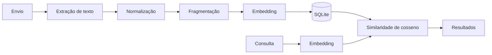

# DodocLens

[](./README.md)

Inteligência documental local-first. Busca semântica nos seus arquivos — totalmente offline, totalmente privada.

   

## Visão geral

O DodocLens é um assistente de documentos pensado para rodar inteiramente na sua máquina. Você envia PDFs, imagens (PNG/JPG) e arquivos de texto simples (`.txt`); o aplicativo extrai texto legível (incluindo OCR quando necessário), divide o conteúdo em trechos (chunks) e gera embeddings semânticos para que você possa buscar por **significado**, e não só por palavras-chave exatas.

A extração de texto usa **PyMuPDF** em PDFs com camada de texto e **Tesseract** (via **pytesseract** e **Pillow**) quando as páginas são efetivamente digitalizadas ou quando a entrada é uma imagem. Os embeddings dos trechos usam **sentence-transformers** com o modelo **`paraphrase-multilingual-MiniLM-L12-v2`** — um modelo multilíngue compacto, adequado a textos jurídicos ou clínicos em português e inglês. A busca ordena os trechos por **similaridade de cosseno** (`cosine_similarity` do **scikit-learn** com vetores **NumPy** no pipeline atual). Não é necessário chamar APIs de inferência na nuvem: após o download único do modelo, documentos e consultas permanecem no seu dispositivo.

O público-alvo inclui **advogados e equipes jurídicas**, **médicos e clínicos**, **pesquisadores** e quem precisa de busca confidencial na própria biblioteca de arquivos, sem enviar dados a terceiros.

## Visão da arquitetura

| Camada | Tecnologia | Função |
|--------|------------|--------|
| Shell desktop | Electron | Hospeda a interface, pode iniciar o backend, acesso ao sistema de arquivos (ex.: seletor de pasta). |
| Interface | React + Vite + TypeScript + Tailwind | SPA: envio de arquivos, biblioteca de documentos, busca semântica; cliente HTTP para a API local. |
| API | FastAPI + Uvicorn | Endpoints REST, tarefas em segundo plano, CORS para desenvolvimento local. |
| Persistência | SQLite + SQLAlchemy | Armazena documentos, texto dos trechos e vetores de embedding serializados. |
| Embeddings | sentence-transformers + PyTorch | Carrega o MiniLM multilíngue; codifica trechos e consultas. |
| Recuperação | scikit-learn (`cosine_similarity`) + NumPy | Compara o vetor da consulta aos vetores dos trechos para obter os melhores resultados. |
| PDF / imagens | PyMuPDF, pytesseract + Pillow | Texto nativo em PDF versus OCR em páginas rasterizadas; OCR em imagens. |



## Pré-requisitos

Instale estes componentes **antes** de executar o app. O **Python** em si deve ser gerenciado com **uv** (evite depender só de um Python global manual para este projeto).

### Python 3.10–3.13 (via uv)

**Não instale o CPython manualmente** pelo gerenciador de pacotes do sistema para este fluxo. Depois que o **uv** estiver instalado (próxima subseção), **`uv sync`** e **`uv python pin 3.13`** (veja a seção **Instalação** abaixo neste documento) baixam e fixam um interpretador suportado (**3.10–3.13**) alinhado ao `backend/pyproject.toml` e ao **`uv.lock`**.

### Node.js 18+

- **Linux (Arch / CachyOS)**

  ```bash
  sudo pacman -S nodejs npm
  ```

- **macOS**

  ```bash
  brew install node
  ```

- **Windows**

  Instale a versão LTS em [nodejs.org](https://nodejs.org/).

### uv (gerenciador de pacotes Python)

- **Linux / macOS**

  ```bash
  curl -LsSf https://astral.sh/uv/install.sh | sh
  ```

- **Windows (PowerShell)**

  ```powershell
  powershell -ExecutionPolicy ByPass -c "irm https://astral.sh/uv/install.ps1 | iex"
  ```

### Tesseract OCR

Necessário para OCR em imagens e em PDFs que precisam de OCR rasterizado. Instale os pacotes de idioma **inglês** e **português** quando disponíveis.

- **Linux (Arch / CachyOS)**

  ```bash
  sudo pacman -S tesseract tesseract-data-eng tesseract-data-por
  ```

- **macOS**

  ```bash
  brew install tesseract tesseract-lang
  ```

- **Windows**

  Instale a partir dos [builds UB Mannheim](https://github.com/UB-Mannheim/tesseract/wiki) e coloque o `tesseract.exe` no **PATH** (veja também comentários em `backend/services/text_extraction.py`).

**Observação:** Depois de `uv sync`, execute **`uv python pin 3.13`** (ou outra versão entre 3.10 e 3.13) dentro de `backend/` para fixar o interpretador do projeto.

## Instalação

1. **Clonar o repositório**

   ```bash
   git clone https://github.com/moonlitrevery/DodocLens.git
   cd DodocLens
   ```

2. **Instalar o uv** (se ainda não estiver instalado)

   ```bash
   curl -LsSf https://astral.sh/uv/install.sh | sh
   ```

   No Windows, use o comando PowerShell da tabela de pré-requisitos.

3. **Instalar dependências Python** (cria `backend/.venv` e instala a partir do lockfile)

   ```bash
   cd backend
   uv sync
   ```

   Lê `pyproject.toml` e `uv.lock`, resolve as dependências e instala em um ambiente virtual isolado.

4. **Fixar a versão do Python** no workspace do backend

   ```bash
   cd backend
   uv python pin 3.13
   ```

5. **Instalar dependências npm na raiz** (ferramentas Electron, `concurrently`, etc.)

   ```bash
   cd ..   # raiz do repositório
   npm install
   ```

6. **Instalar dependências do frontend**

   ```bash
   npm install --prefix frontend
   ```

**Primeiro download do modelo:** Na primeira execução que gera embeddings, o **sentence-transformers** baixa o modelo **`paraphrase-multilingual-MiniLM-L12-v2`** (~**120 MB**). É preciso internet **uma vez**; depois o modelo fica no cache do Hugging Face (use `HF_HOME` se quiser outro diretório).

## Executando o aplicativo

### Só o backend

```bash
cd backend
uv run python main.py
```

A API fica em **http://127.0.0.1:8000**.

### Só o frontend (navegador; o backend precisa estar rodando)

```bash
cd frontend
npm run dev
```

A interface é servida em **http://127.0.0.1:5173** (porta padrão do Vite).

### Aplicativo desktop completo (Electron)

**Terminal 1 — backend**

```bash
cd backend
uv run python main.py
```

**Terminal 2 — Electron** (na **raiz do repositório**)

```bash
export DODOC_PYTHON="$(pwd)/backend/.venv/bin/python"
npm run dev
```

No **Windows (PowerShell)**, na raiz do repo:

```powershell
$env:DODOC_PYTHON = "$PWD\backend\.venv\Scripts\python.exe"
npm run dev
```

**Por que `DODOC_PYTHON`:** O Electron pode iniciar o FastAPI com um `python3` do sistema que **não** tem as dependências do projeto. Definir `DODOC_PYTHON` para o interpretador gerenciado pelo **`uv`** dentro de `backend/.venv` garante que o backend suba com os pacotes corretos (FastAPI, sentence-transformers, etc.).

### Build de produção

```bash
npm run electron:prod
```

Executa **`npm run build --prefix frontend`** (gera `frontend/dist/`) e em seguida inicia o Electron, que carrega a SPA estática em vez do servidor de desenvolvimento do Vite.

## Testando cada módulo

#### 7.1 API do backend (health check FastAPI)

```bash
curl http://127.0.0.1:8000/health
```

**Saída esperada:**

```json
{"status":"ok"}
```

#### 7.2 Extração de texto

No diretório **`backend/`**, com um caminho de arquivo real:

```bash
cd backend
uv run python -c "
from pathlib import Path
from services.text_extraction import extract_text
text = extract_text(Path('path/to/your.pdf'), 'application/pdf')
print(text[:500])
"
```

**Esperado:** Até 500 caracteres do texto extraídos no stdout (pode ser vazio em PDFs em branco).

#### 7.3 Modelo de embedding

```bash
cd backend
uv run python -c "
from services.embeddings import embed_texts
vecs = embed_texts(['teste de embedding'])
print(vecs.shape)
"
```

**Esperado:** `(1, 384)` — uma linha, vetor de 384 dimensões nesta configuração do modelo.

#### 7.4 Busca semântica (via API)

```bash
curl -X POST http://127.0.0.1:8000/search \
  -H "Content-Type: application/json" \
  -d '{"query": "sua consulta aqui"}'
```

**Esperado:** JSON com um array `results` (pode estar vazio até haver documentos indexados e com status `ready`).

#### 7.5 Importação em lote por pasta (Electron)

A importação por pasta usa o seletor nativo de diretório e, no Electron, pode enviar caminhos absolutos para **`POST /upload/batch`**. Execute o **app Electron completo** (`npm run dev` com o backend ativo), abra a página **Enviar** e clique em **Importar pasta**. Depois de escolher a pasta, os arquivos suportados entram na fila de processamento.

**Esperado:** Toasts por arquivo importado e um resumo; novas linhas aparecem em **Documentos** conforme o processamento termina.

#### 7.6 Teste de OCR (imagem)

No **`backend/`**, apontando para um PNG no disco:

```bash
cd backend
uv run python -c "
from pathlib import Path
from services.text_extraction import extract_text
text = extract_text(Path('path/to/your.png'), 'image/png')
print(text[:500])
"
```

**Esperado:** Texto reconhecido pelo OCR (a qualidade depende da resolução da imagem e dos dados de idioma do Tesseract).

## Variáveis de ambiente

| Variável | Padrão | Descrição |
|----------|--------|-----------|
| `DODOC_PYTHON` | Detectado automaticamente (`backend/.venv` quando existe) | Caminho absoluto do executável Python que o Electron usa para iniciar `backend/main.py`. |
| `VITE_API_URL` | `http://127.0.0.1:8000` | URL base do cliente Axios no frontend (defina antes de `npm run dev` em `frontend/`). |
| `DODOC_LOAD_DIST` | não definido | Se for `1`, o Electron prefere carregar **`frontend/dist`** em vez do servidor de desenvolvimento do Vite (útil em fluxos tipo `npm run electron:prod`). |
| `HF_HOME` | padrão da plataforma | Opcional: altera o diretório de cache do Hugging Face / sentence-transformers. |

## Estrutura do projeto

```text
DodocLens/
├── LICENSE                         # Texto da licença GPL-3.0
├── README.md                       # README em inglês
├── README.pt-BR.md                 # Este arquivo (português do Brasil)
├── package.json                    # Scripts na raiz: Electron, dev, produção
├── electron/
│   ├── main.cjs                    # Processo principal: janela, backend, IPC
│   └── preload.cjs                 # contextBridge: plataforma, API de pasta
├── backend/
│   ├── pyproject.toml              # Dependências Python (uv)
│   ├── uv.lock                     # Versões fixadas das dependências
│   ├── main.py                     # Entrada FastAPI + lifespan / CORS
│   ├── database/
│   │   ├── __init__.py
│   │   └── connection.py           # Engine SQLAlchemy + sessão
│   ├── models/
│   │   ├── __init__.py
│   │   ├── orm.py                  # Modelos ORM Document / Chunk
│   │   └── schemas.py              # Modelos Pydantic (request/response)
│   ├── routes/
│   │   ├── __init__.py
│   │   ├── upload.py               # POST /upload
│   │   ├── batch.py                # POST /upload/batch (caminhos locais)
│   │   ├── documents.py            # GET /documents, GET /documents/{id}
│   │   └── search.py               # POST /search
│   ├── services/
│   │   ├── __init__.py
│   │   ├── text_extraction.py      # PyMuPDF + OCR Tesseract
│   │   ├── file_storage.py         # Salva uploads em backend/data/uploads
│   │   ├── processing.py           # Pipeline em segundo plano: extrair → embed → SQLite
│   │   ├── chunking.py             # Chunking em janelas de palavras
│   │   ├── embeddings.py           # Singleton sentence-transformers
│   │   └── search_service.py       # Busca semântica sobre vetores armazenados
│   └── utils/
│       ├── __init__.py
│       └── text.py                 # Normalização de texto
└── frontend/
    ├── index.html                  # HTML base do Vite
    ├── package.json                # Dependências React, Vite, Tailwind
    ├── vite.config.ts              # Configuração do Vite
    ├── tsconfig.json
    ├── tailwind.config.js
    ├── postcss.config.js
    └── src/
        ├── main.tsx                # Raiz do React
        ├── App.tsx                 # Roteador + layout
        ├── global.d.ts             # Tipagens window (ex.: electronAPI)
        ├── vite-env.d.ts
        ├── index.css               # Estilos globais / camadas Tailwind
        ├── types.ts                # Interfaces TypeScript compartilhadas
        ├── api/
        │   └── client.ts           # Instância Axios + URL base
        ├── context/                # Provedores toast, tema
        ├── components/             # Layout, barra lateral, modais, widgets
        ├── pages/                  # Enviar, Documentos, Busca
        └── utils/                  # Destaque de termos, formatação de data, etc.
```

Diretórios em tempo de execução, como **`backend/data/`** (banco SQLite, uploads), são criados ao rodar o app; podem não existir num clone novo.

## Problemas conhecidos e limitações

- **Python 3.14+** pode quebrar wheels nativos (ex.: **pydantic-core** / PyO3). Use **Python 3.10–3.13**, com `uv python pin`.
- **Primeira execução** baixa o modelo de embedding (~**120 MB**); internet é necessária **uma vez**, salvo cache pré-preenchido.
- **MVP de busca:** todos os embeddings dos trechos são carregados do SQLite na RAM a cada consulta — ok para bibliotecas pequenas, não para corpora enormes.
- O **Tesseract** é um binário de sistema separado; precisa estar instalado e no `PATH` (ou configurado para o pytesseract no Windows).
- **Modo navegador (dev):** a importação por pasta envia arquivos **um a um** via **`POST /upload`**; **não** usa **`POST /upload/batch`** (esse endpoint espera caminhos absolutos vindos do Electron).

## Participantes

Alunos que participaram do projeto:

- João Vitor Bruschi  
- Nícolas Justo  
- Jean Victor Yoshida  
- João Pedro Penna  

Repositório: [github.com/moonlitrevery/DodocLens](https://github.com/moonlitrevery/DodocLens)

## Licença

Este projeto está licenciado sob a **GNU General Public License v3.0** — veja o arquivo [`LICENSE`](./LICENSE) para o texto completo.
